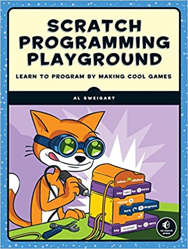

## Aprenda lógica de programação neste curso passo a passo.

Você aprenderá a programar criando jogos divertidos onde os jogadores destroem 
asteróides, jogam basquete e fogem de labirintos! Cada jogo inclui instruções 
fáceis de seguir, perguntas de revisão e desafios criativos de codificação para 
tornar o jogo seu. Deseja adicionar mais níveis ou um código de trapaça? 
Não tem problema, basta escrever um código.

O Scratch é uma ferramenta interessante para aqueles que desejam aprender a 
programar. No Brasil, é utilizado tanto na Educação Básica como nas 
universidades. Scratch é uma linguagem de programação criada em 2007 pelo Media 
Lab do MIT. Desde 2013 o Scratch 2 está disponível on-line e como uma aplicação 
para Windows, OS X, e Linux.

Baseado no Livro: [Scratch Programming Playground <3!](https://inventwithscratch.com/)

